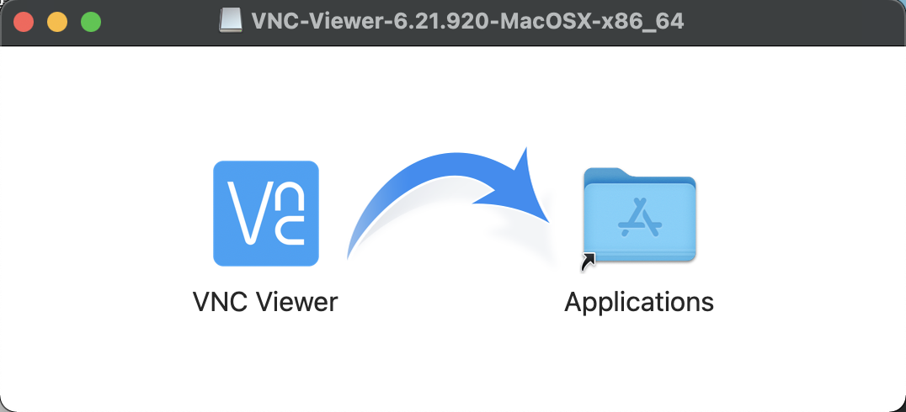
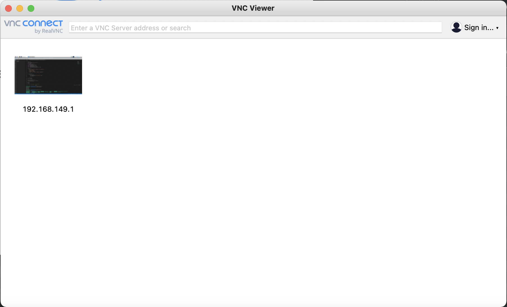
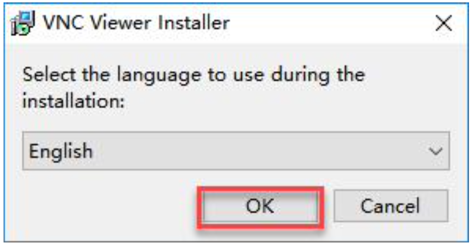
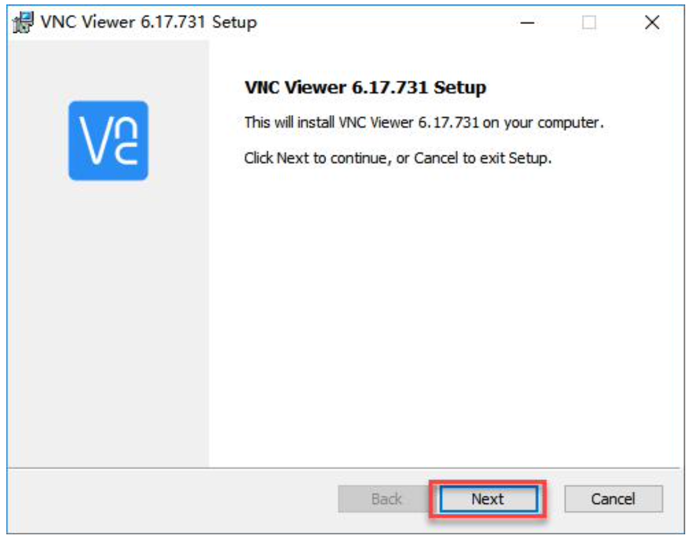
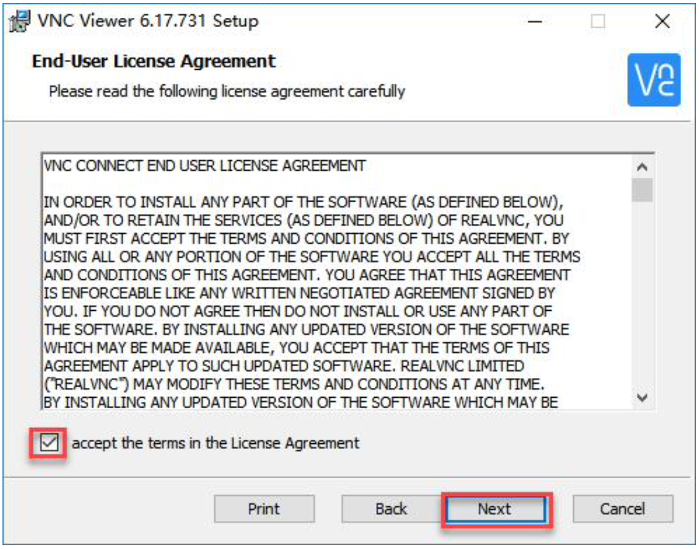
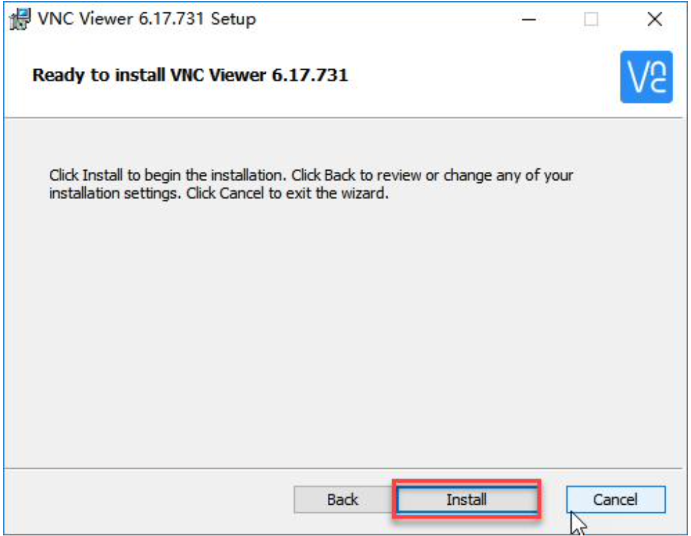
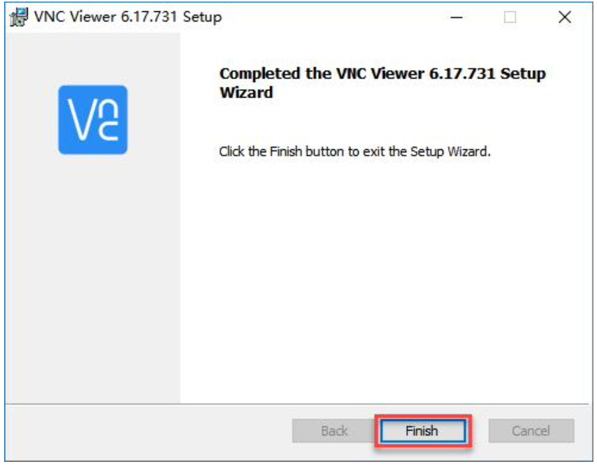
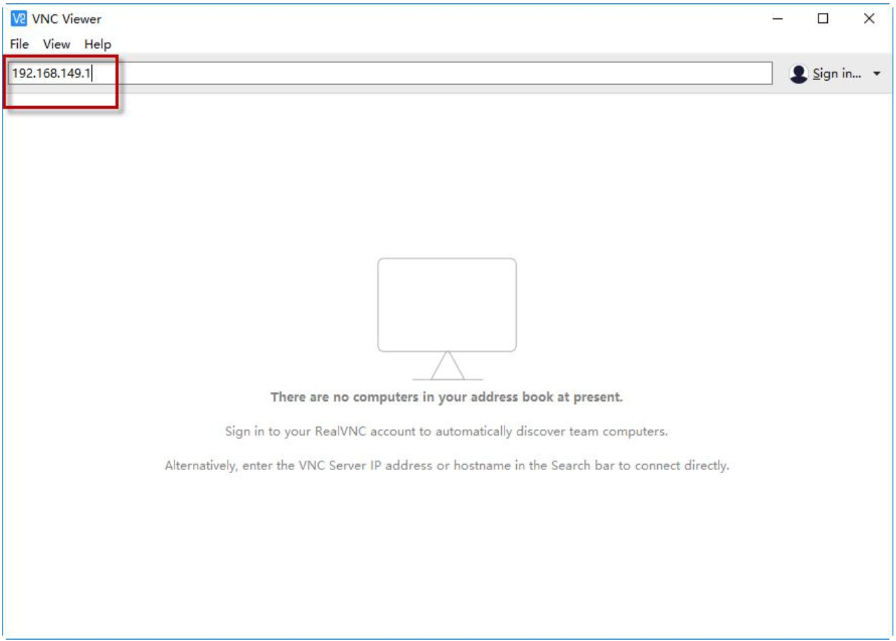

# 远程登录工具Vnc Viewer安装与连接

本文档将说明电脑端直连树莓派4B所需工具Vnc Viewer的安装

**设备要求：**准备一台笔记本电脑，如使用台式电脑请自备无线网卡(需支持5G频段)。如果不支持 5G，则可能会搜索不到树莓派产生的热点。

## 1. 安装包下载

安装包已放置在`/tool/vnc-viewer/`下，包含mac版本和windows版本（Freeze:2021-11-04日），如需其他版本，请在[官网](https://www.realvnc.com/en/connect/download/viewer/)下载。

## 2. 安装

### Mac Version

step 1：下载mac版本安装包`/tool/vnc-viewer/mac/VNC-Viewer-6.21.920-MacOSX-x86_64.dmg`

step 2：双击打开dmg安装包，将软件图标拖动至Applications应用文件夹内。(如果有权限验证，正常输入密码即可)

step 3: 安装完成

### Windows Version

step 1 : 下载windows版本安装包`/tool/vnc-viewer/windows/VNC-Viewer-6.21.920-Windows.exe`

step 2: 双击安装包，在弹出的对话框中选择安装语言为“**English**”，单击“**OK**”按钮。

step 3: 在弹出的界面单击“**Next**”按钮。

step 4:在新的提示框中勾选同意协议，然后单击“**Nex**t”，接着弹出安装位置设置，保持默 认设置，继续单击“**Next**”。

step 5:在新弹出的页面中单击“**Install**”。

step 6:等待安装，片刻之后出现安装完成提示页面，单击“**Finish**”按钮即可完成安装。

step 7:安装完成

## 3. 设备连接 - 远程登录

step 1：开机 - 在电池对接线连接完成后打开开关。稍等片刻后树莓派扩展板上的LED2 由常亮变为每隔 2 秒闪烁一次，即为成功开机标志。

step 2：TonyPi在开机后，会产生一个HW开头的热点，我们可以打开电脑Wi-Fi搜索并连接这个热点

step 3:	在打开的 VNC Viewer 中输入树莓派默认的 IP 地址:**192.168.149.1**，然后按回车， 如果提示不是安全连接的话单击“Continue”。

step 4: 此时弹出一个提示框，要求输入账号(Username)和密码(Password)，账号输入: pi，密码输入:raspberry，勾选上记住密码框，然后单击“**OK**”，然后便可看到远程打开的树 莓派的桌面了。

step 5: 桌面若出现警告对话框(树莓派本身特性)，单击“确定**”**关闭即可。(如果是黑屏， 只有一个鼠标，则可尝试重新启动树莓派。)