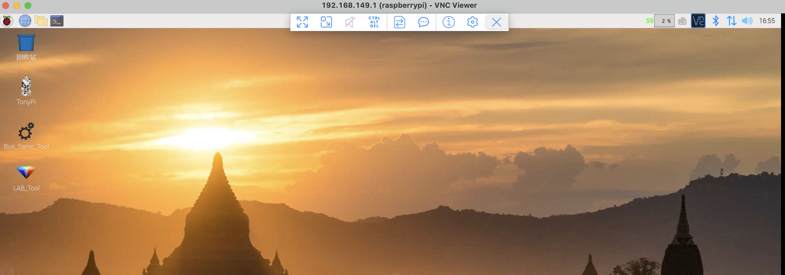
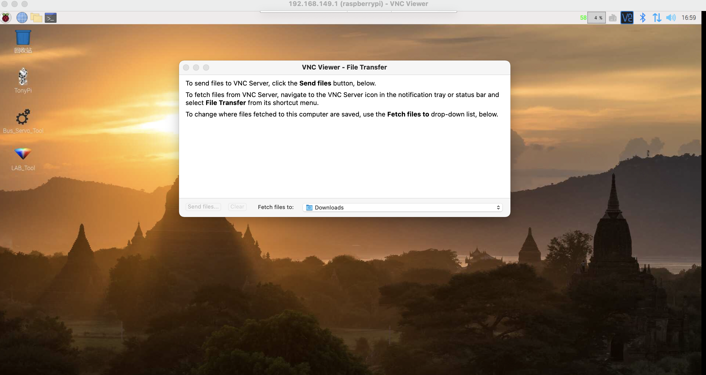
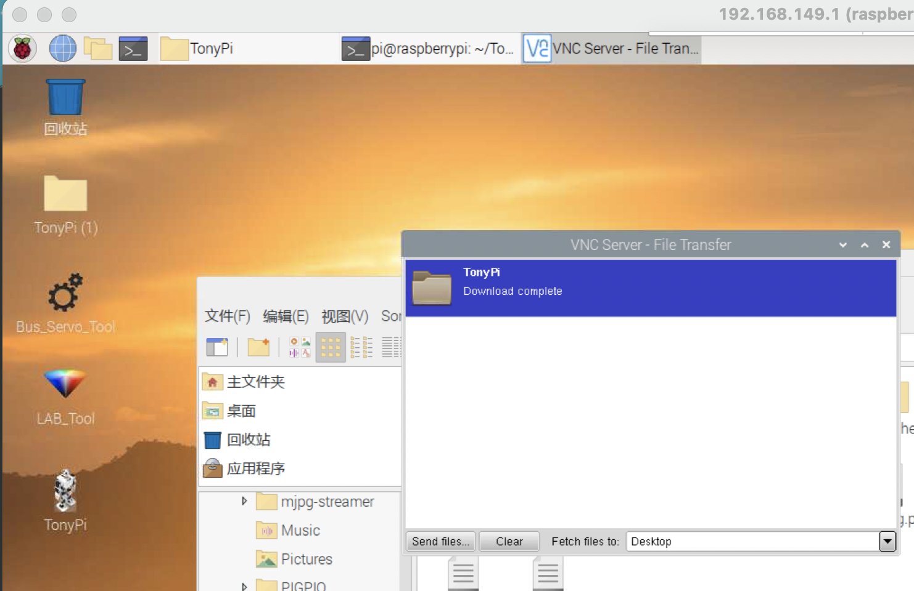
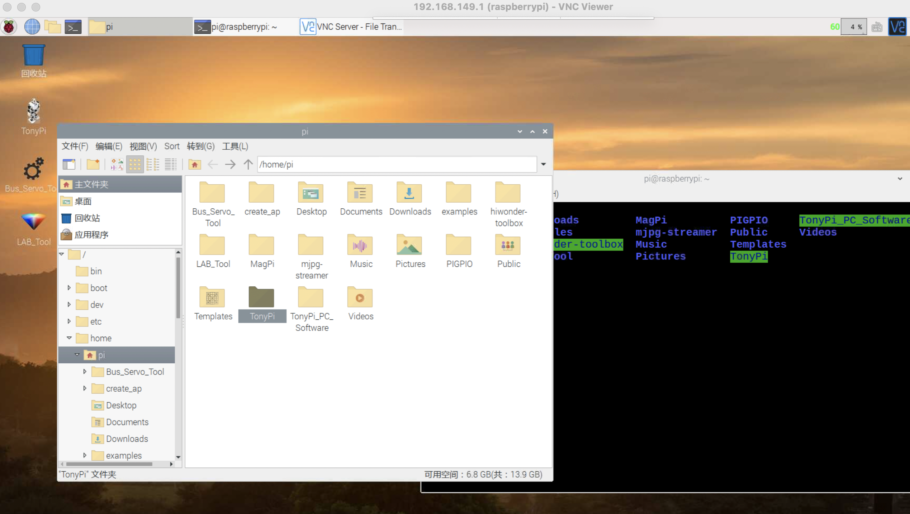
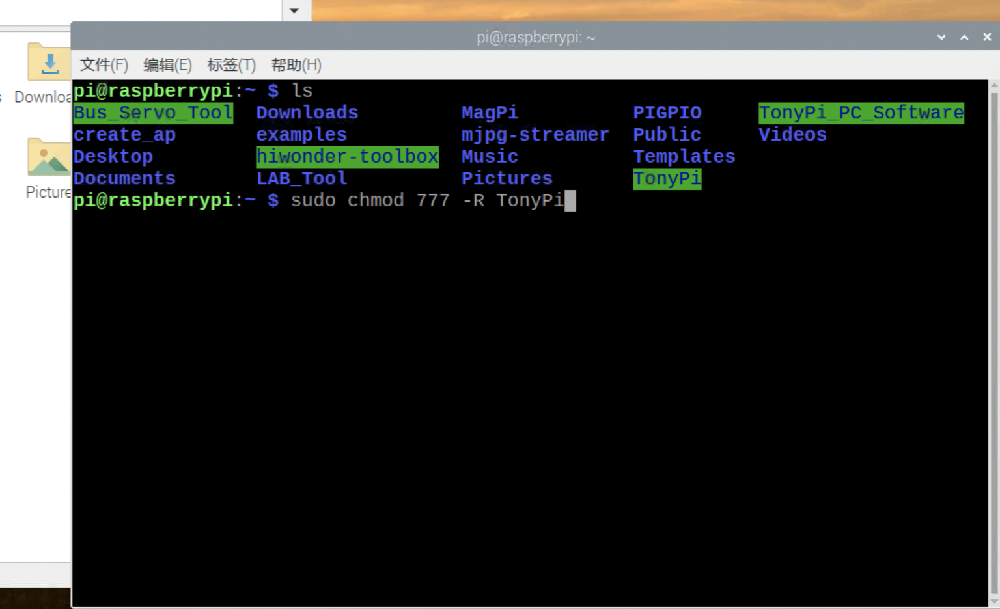
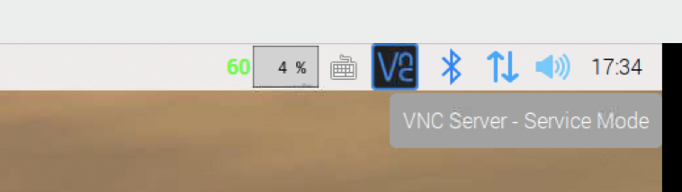
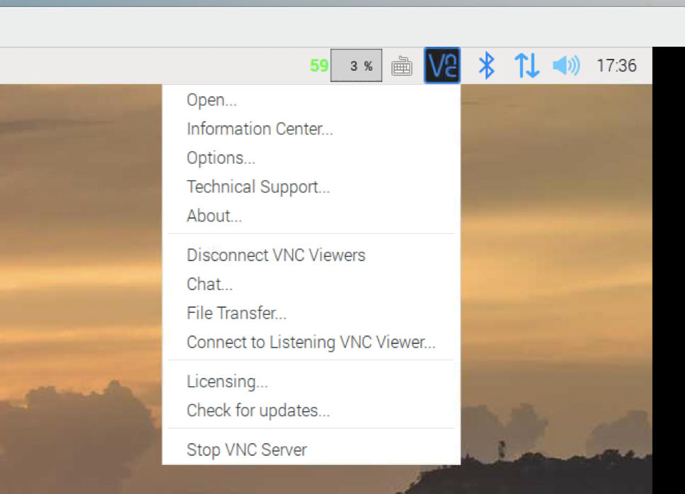
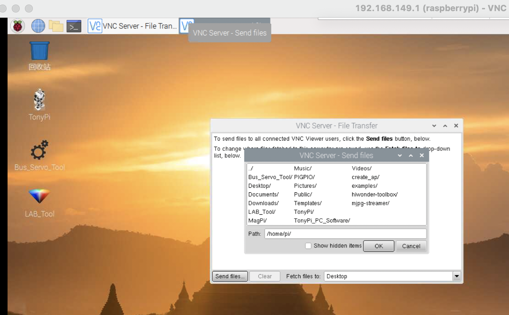

# 源码恢复与文件传输相关说明

## 1 源码恢复(含vnc-viewer文件上传与源码权限修改)

实验室的机器人为大家共用，上一位同学使用后可能修改了机器人的核心源码，导致试验进行异常。**为了保证其他同学试验的正常体验**，大家请尽量**不要修改**`/home/pi/TonyPi`**以外**的文件。而每次试验之前，如果想要将机器人操作源码恢复到出厂状态，请大家按如下说明进行操作。

豪华版源码已经存放在本仓库`/src_code/TonyPi`处(也可以在u盘中`124.TonyPi智能视觉人形机器人/124.TonyPi智能视觉人形机器人/5.附录/2.源码/豪华版套餐源码/TonyPi`中找到)。

(1) 试验开始前先准备好你想要的源码，连接上机器人（连接方法参看[远程登录工具安装与连接](./2021-11-04-remoteToolInstall.md)第3节）。本示例中待恢复源码为`src_code`中的`TonyPi`文件夹下的代码。

(2) 将鼠标移动到vnc-viewer窗口上部，会出现一个操作条(如上图所示)，点击操作条中的第5个按钮(file transfer)可以从你本地计算机上选择文件传输到树莓派上。

(3) 点击上面界面中左下角`send files`按钮，就可以选择本地文件或文件夹，上传到树莓派，此处上传到了桌面上。注意：mac版本直接选中文件夹，点击`open`即可以上传整个文件夹，windows版本需要使用`use entire folder`按钮才可上传文件夹。

(4) 将桌面上的TonyPi文件夹移动到`/home/pi`文件夹下（注意之前的文件夹需要删除）

(5) **Attention**: 权限设置！直接移动过来的文件很可能没有权限，导致环境中运行代码的时候出现找不到包的问题，需要打开命令行给予读写权限：命令`sudo chmod 777 -R TonyPi `，以递归的方式给TonyPi文件夹读写文件。

## 2 将树莓派的文件传输到本地

(1) 将鼠标移动到右上角vnc的图标上，点击鼠标**右键**，打开菜单

(2) 选择其中的`File Transfer`功能

(3) 在弹出的窗体中，点击send files就可以将树莓派上的文件传到本地

