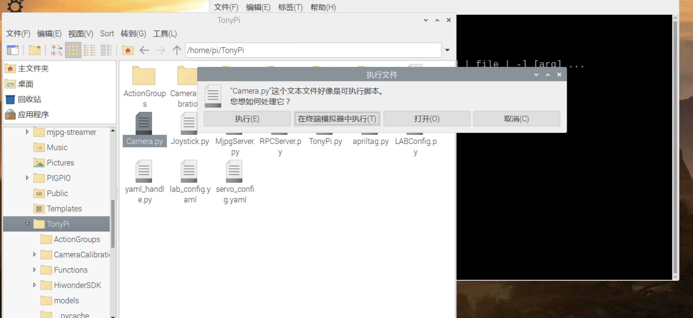
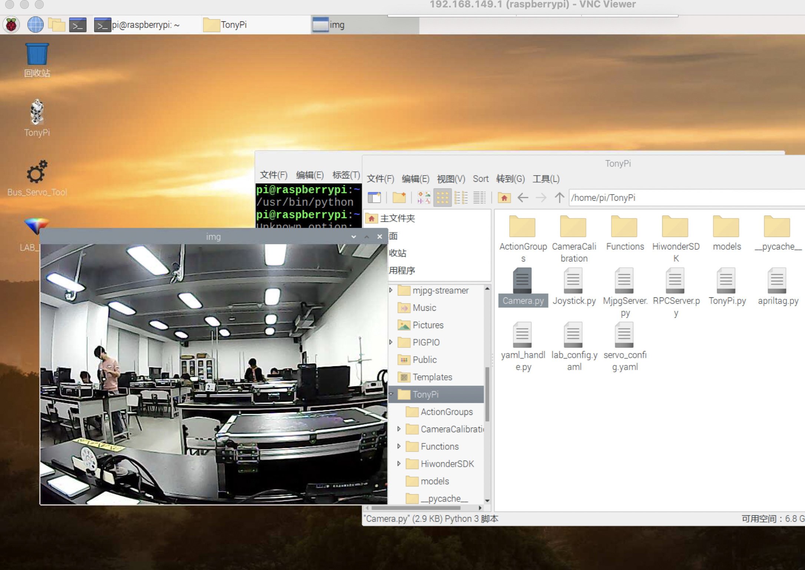
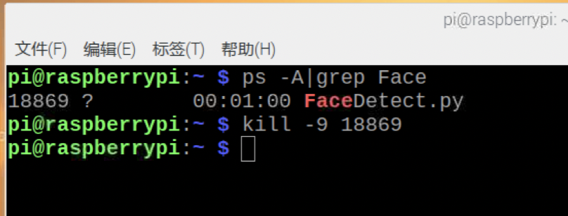
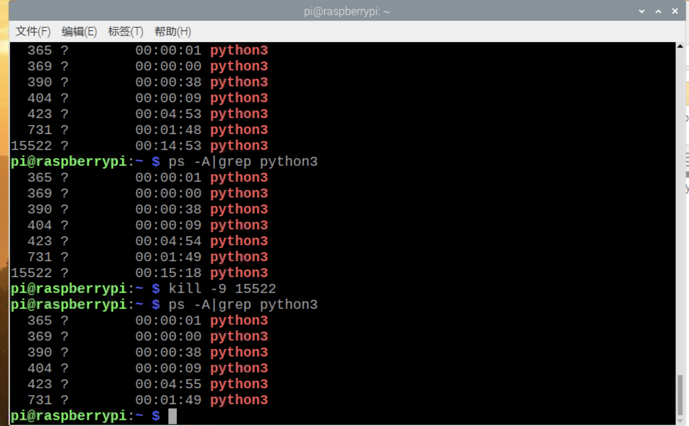

# 机器人操作注意事项

## 1 机器人开关机

**开机：** 上图中1为电源开启键，推至右边则开启电源，并且树莓派自动开机，当2中的两个灯LED1常亮、LED2闪烁时，说明内部树莓派系统启动成功。

**关机： ** **Attention**！和电脑关机类似，直接关电源前需将系统关闭，不然可能会损伤机器人。长按图中3下方的白键，等2的灯变暗，说明树莓派系统已经关闭，此时再关闭1即可。

## 2 在树莓派中运行代码无法终止怎么办

在树莓派运行机器人代码有三种可能的方式

(1) 如果在ide中运行程序，直接点击功能栏中的终止按钮即可，不做详述

(2) 如果在终端中使用`sudo python3 filename.py`直接运行的代码，可在终端窗口使用`ctrl + c`强制终止进程

(3) 如果有同学不小心双击了脚本，并且不小心直接选择了执行，因为大多数脚本没有实现退出功能，会死循环

比如这里直接执行了camera，将无法使用直接关闭该进程

此时可以打开终端，使用`ps -A | grep {脚本名称}`找到正在进行的进程id，其中{脚本名称}替换成你的脚本的名称，部分即可，比如我们这里正在循环的脚本是`FaceDetect.py`，所以在终端中输入命令`ps -A | grep Face`,可以找到进程id（第一个数字），然后使用`kill -9 {进程id}`就可以杀死这个进程了

但有些脚本他的进程名字不是脚本名，这时可以查询python3，一般pid比较大的那个是最新运行的，kill他就可以了

