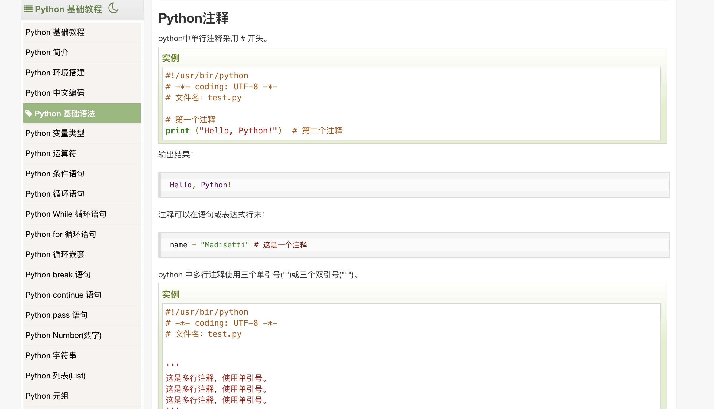
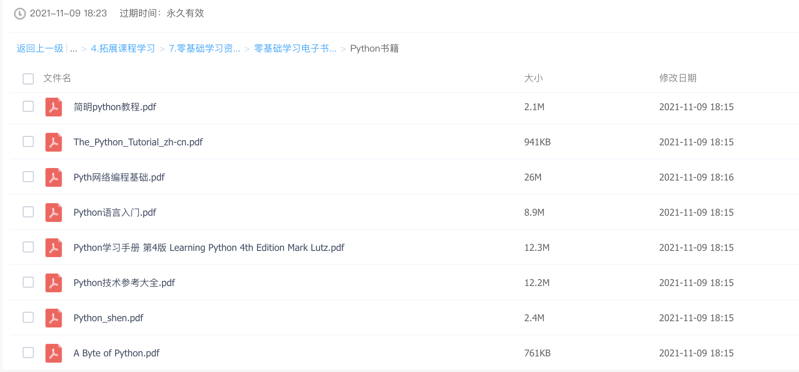

# Python基础学习

注1：该教程旨在为python学习提供基本方向，如果你已经能够熟练运用python，不妨跳过本教程

注2：该教程不会详细讲解知识点，只会给出学习路线，请同学们在课后学习、揣摩、实践各知识点

注3：教程编写仍处在探索阶段，后续将持续更新，任何问题欢迎在issues或讨论群中提出

## 0 python安装说明

单纯的python安装，可参考菜鸟教程中[python环境搭建](https://www.runoob.com/python/python-install.html)一节

但其实更推荐直接安装conda（anaconda或者miniconda）。conda是一种python的包与环境管理工具，conda中自己已经集成了python本体，并且还能创建各个不同的python版本的环境。

anaconda有图形界面，miniconda则完全使用命令行。个人更喜欢使用miniconda，因为它小而快。读者可根据需要安装使用。

[anaconda安装与使用视频](https://www.bilibili.com/video/BV1Pk4y1o7S5/)

清华镜像：https://mirror.tuna.tsinghua.edu.cn/help/anaconda/
miniconda：https://docs.conda.io/en/latest/miniconda.html

## 1 python语法学习

​		有C++基础的同学，学习python会很快。对于有编程功底的朋友，在学习一门新的编程语言时，笔者非常推荐快速地浏览基础的编程语法，并脑海中类比所学过编程语言的相关内容。

​		网络上有诸多python语法入门教程，但笔者结合经验与实际，推荐使用[菜鸟教程](https://www.runoob.com/python/python-tutorial.html)来熟悉python基础语法（点击超链接可跳转）

​		请注意查看教程的方式，对于难以记住的地方，你可以跳过他，但你至少需要知道有什么东西，在遇到的时候能够返回来查看。如果你有c++编程基础，你没必要在语法上面花太多时间，相信一个小时应该已经足够你阅读完Python基础教程部分，这已经足够你看懂大部分代码了。

​		而python高级教程部分，推荐阅读一下`面向对象`、`JSON`、`2.X和3.X的区别`、`多线程`几节。

			- 面向对象中讲解`class`的定义，请注意变量的定义、`__init__`内置属性的使用等；
			- Json是非常常用的保存数据的格式，他在python的存取操作需要有一定了解；
			- python2版本和python3版本其实只有些许不同（print有没有括号），放在这只是作为拓展知识；
			- `多线程`一节中讲解thread包，这在异步操作中挺常用的，在一些程序中采用异步操作能够大大提高效率。

​		菜鸟教程中数据库一节讲解的是mysqldb，但是现在比较常用的是pymysql，感兴趣的朋友可以自信检索

​		除了菜鸟教程，网盘中也提供了一些0基础学习python的资料，同学们可以自取

## 2 一些python常用技巧

- 多变量赋值 `a, b = 1, 2`
- lambda表达式 `lambda x: x*2`  (常常与map等结合使用)
- 内置的map和pandas中的map  
  - 内置map：`list(map(lambda x: x*2, [1, 2, 3, 4]))` 返回结果为`[2, 4, 6, 8]`
  - pandas中的map，此处`data`为`Series`类型: `data.map(lambda x: x*2)`
- 简写的if-else语句：`x = 1 if a == b else 2`
- 简写的if判定，当变量值为`[]、None、""、False`等值时，if均会视为False判定
- 列表生成表达式：`[i for i in range(4)]`，生成结果`[0, 1, 2, 3]`
- `if __name__ == '__main__':`作为程序入口
- `try:`和`except:`作为错误处理，详见菜鸟教程

## 3 python包学习（拓展）

- pandas
  - 注意文件读写csv excel
  - 注意iloc、loc等区别   
  - 注意DataFrame.apply、Series.map等映射函数的使用，注意lambda表达式
- 文件操作  os  包：`os.system()`可以调用服务器的命令，`os.path`的几个函数操作路径，`os.walk`遍历目录
- 数据库操作：`pymysql`包
- python数据可视化  `seaborn`  `matplotlib`   (有需要用到搜)
- 简单易用的机器学习框架 
  - pytorch  https://pytorch.org/tutorials/ (跟着tutorial做)；
  - scikit 常见的机器学习模型都有
- 计算机视觉：
  - opencv 
  - tutorial：https://docs.opencv.org/4.x/d6/d00/tutorial_py_root.html   
  - 举例：https://docs.opencv.org/4.x/d3/db7/tutorial_hdr_imaging.html
- 自然语言处理、语音
  - 常用预训练模型：bert  
  - 开源举例：paddle https://www.paddlepaddle.org.cn/modelbase
- 代码资源：灵活运用github