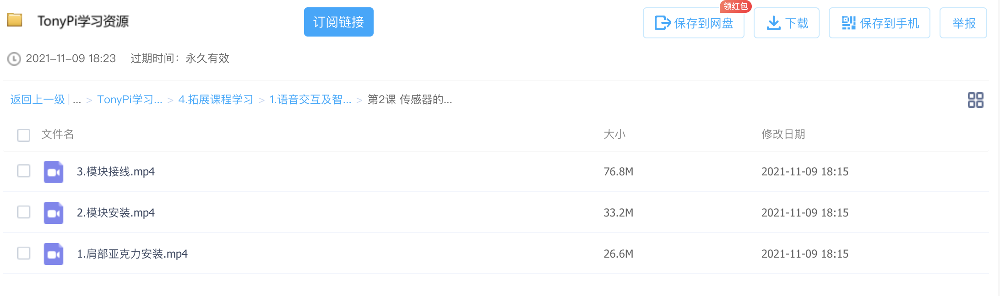

# 声音模块简单说明

## 1 模块安装

参考网盘文件中`TonyPi学习资料/4.拓展课程学习/1.语音交互及智能搬运课程/第2课 传感器的安装与接线`中的视频内容完成



安装模块时请小心螺丝不要遗落

## 2 代码与操作说明

内置的代码与试验请参考`TonyPi学习资料/4.拓展课程学习/1.语音交互及智能搬运课程`中的相关内容，此处简单介绍语音模块

```python
#!/usr/bin/env python3
# encoding: utf-8
import os
import sys
import time
sys.path.append('/home/pi/TonyPi/')

from LABConfig import *
# from ActionGroupDict import *
# import HiwonderSDK.ActionGroupControl as AGC  # 动作控制，此处不使用
import HiwonderSDK.TTS as TTS   # 语音合成
import HiwonderSDK.ASR as ASR   # 语音识别

sentences = [
    ["你好",'欢迎来到','机器人社'],
]

tts = TTS.TTS()

def speak(words):
    for word in words:
        tts.TTSModuleSpeak('[h0][v10][m3]', word)
        time.sleep(1)

speak(sentences[0])
```

更多说明查看代码模块`TTS.py` `ASR.py`