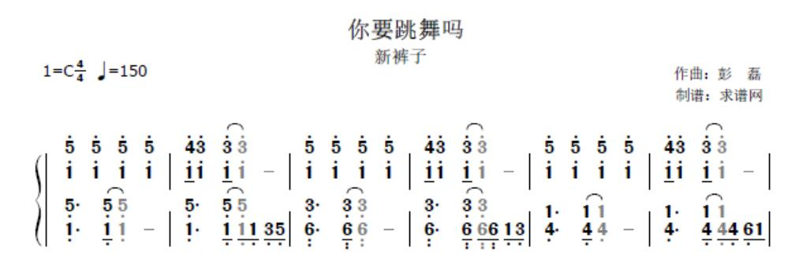
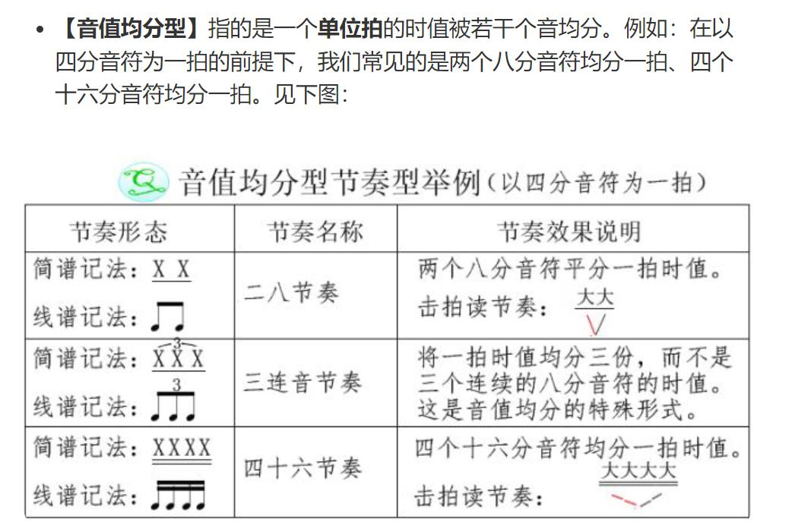
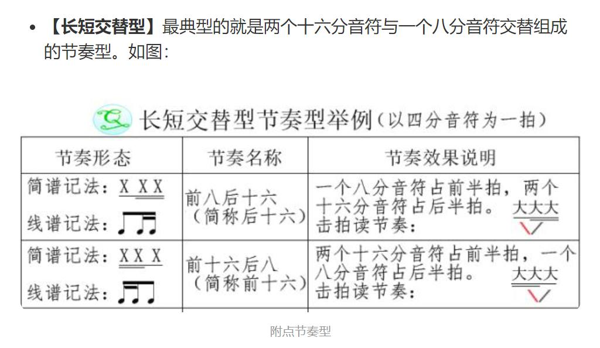
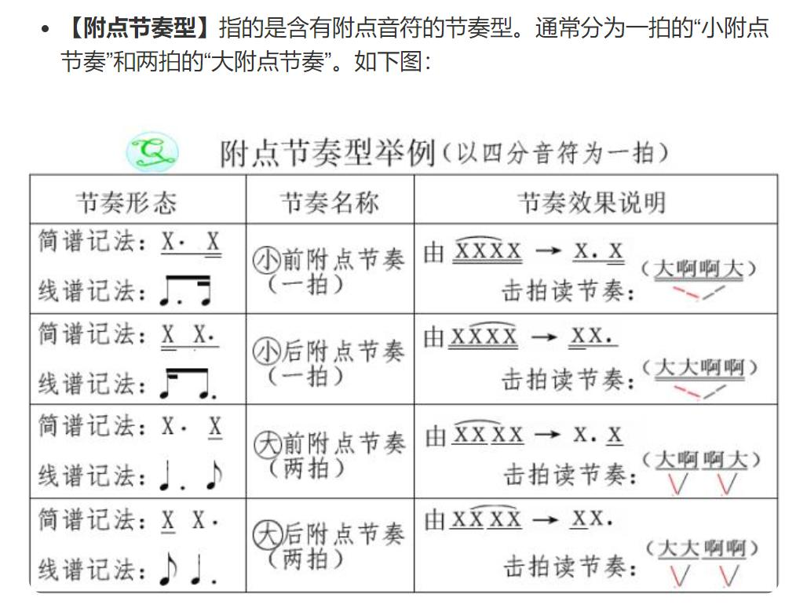
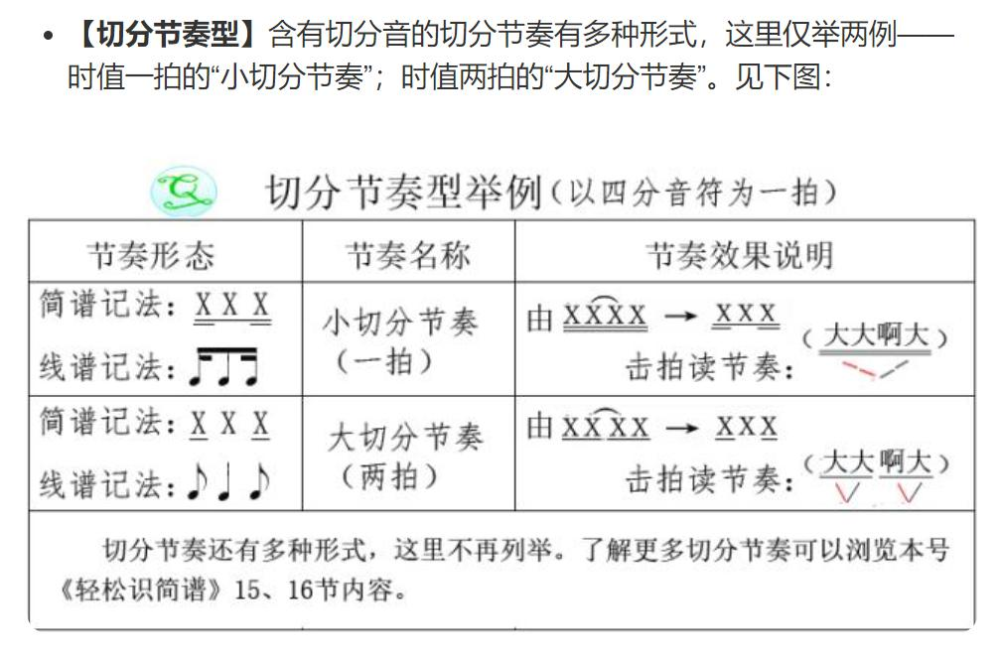
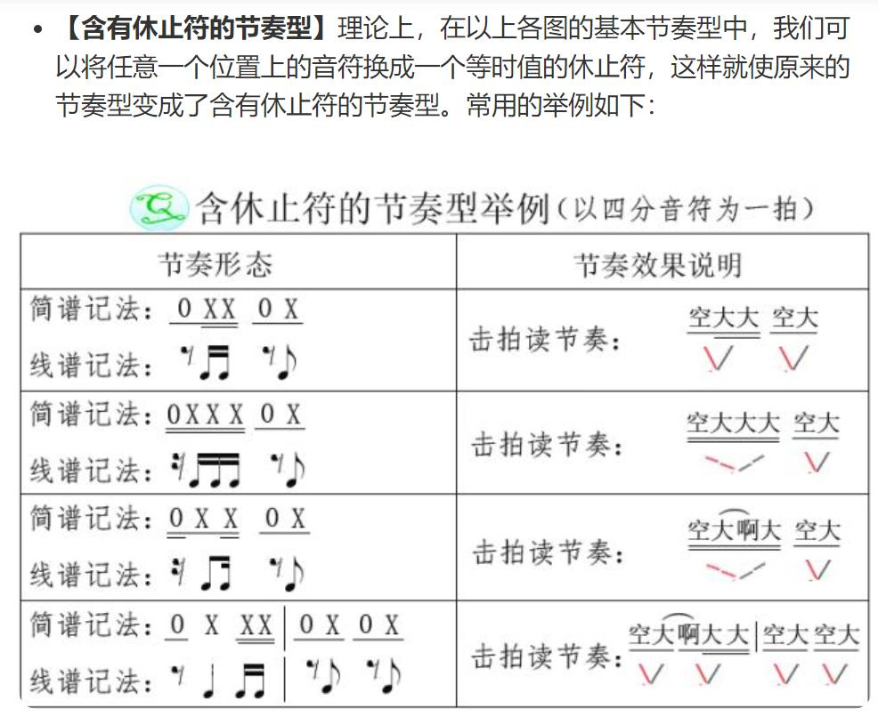
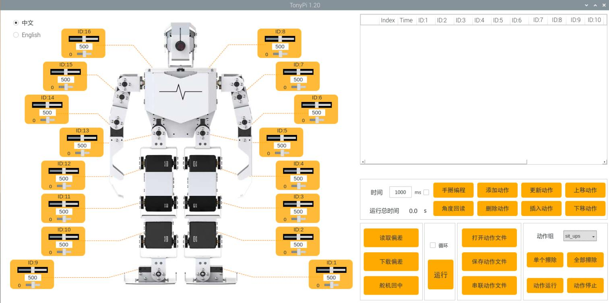

# 机器人编舞相关

## 一、简单乐理知识

### 1. 选曲要求

    节奏清晰、速度适中

### 2. 一些基础的节拍型

    一般编舞以八拍为一个动作组

    动作的展现主要考虑编排和卡点

## 二、机器人编舞注意点

### 1. 建议直接修改原有动作组文件

### 2. 动作组内衔接尽量平滑

### 3. 动作组间尽量使用同一个动作或者能够衔接的动作

### 4. 可能引起摔倒的原因：动作过快&&重心不稳

